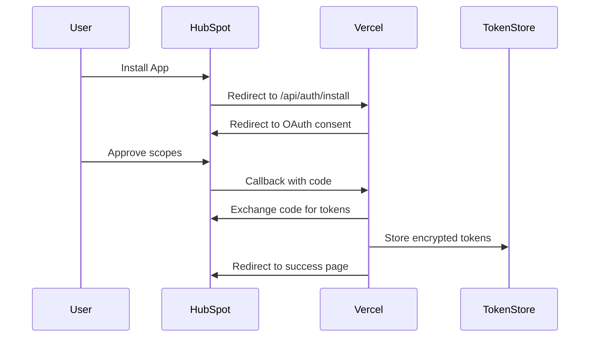
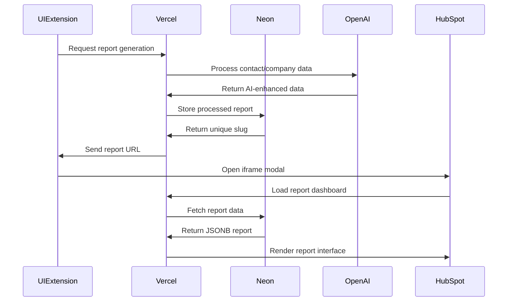

# Technical Solution Architecture

## HubSpot UI Extension with Sales Intelligence Backend

### Architecture Overview

```
┌─────────────────────┐     ┌─────────────────────┐     ┌─────────────────────┐
│   HubSpot CRM       │     │   Vercel Backend    │     │   Neon Database     │
│                     │     │                     │     │                     │
│ ┌─────────────────┐ │     │ ┌─────────────────┐ │     │ ┌─────────────────┐ │
│ │ UI Extension    │ │────▶│ │ OAuth Handler   │ │────▶│ │ PostgreSQL 17   │ │
│ │ (React)         │ │     │ └─────────────────┘ │     │ └─────────────────┘ │
│ └─────────────────┘ │     │                     │     │                     │
│                     │     │ ┌─────────────────┐ │     │ ┌─────────────────┐ │
│ ┌─────────────────┐ │     │ │ Sales Intel API │ │────▶│ │ JSONB Reports   │ │
│ │ Context Data    │ │     │ └─────────────────┘ │     │ └─────────────────┘ │
│ └─────────────────┘ │     │                     │     │                     │
│                     │     │ ┌─────────────────┐ │     │ ┌─────────────────┐ │
│ ┌─────────────────┐ │     │ │ AI Processing   │ │     │ │ Drizzle ORM     │ │
│ │ hubspot.fetch() │ │────▶│ └─────────────────┘ │     │ └─────────────────┘ │
│ └─────────────────┘ │     └─────────────────────┘     └─────────────────────┘
└─────────────────────┘
```

### Component Architecture

#### 1. HubSpot UI Extension (Frontend)

```typescript
// Component Structure
├── src/app/extensions/
│   ├── ReportSelector.jsx       // Main UI component
│   ├── report-card.json         // Extension configuration
│   ├── hooks/
│   │   ├── useReports.js       // Report fetching logic
│   │   └── useHubSpotContext.js // Context handling
│   └── components/
│       ├── ReportDropdown.jsx   // Report selection
│       └── LoadingState.jsx     // Loading indicator
```

#### 2. Sales Intelligence Backend (Vercel)

```typescript
// API Structure
├── server/
│   ├── index.ts               // Express server entry
│   ├── routes.ts              // API route definitions
│   ├── db.ts                  // Neon database connection
│   └── services/
│       ├── openai.ts          // AI processing service
│       └── schema-registry.ts // Report schema management
├── client/                    // React frontend
│   ├── src/
│   │   ├── components/        // Report display components
│   │   ├── pages/            // Report pages
│   │   └── lib/              // Utilities and types
└── shared/
    └── schema.ts              // Database schema definitions
```

#### 3. Integration Flow

##### OAuth Authentication Flow



##### Sales Intelligence Report Flow



### Data Models

#### OAuth Token Model

```typescript
interface OAuthToken {
  hubspotAccountId: string;
  accessToken: string;
  refreshToken: string;
  expiresAt: Date;
  scopes: string[];
  createdAt: Date;
  updatedAt: Date;
}
```

#### Report Configuration

```typescript
interface ReportConfig {
  id: string;
  name: string;
  description: string;
  endpoint: string;
  requiredContext: ('contactId' | 'companyId')[];
  permissions: string[];
}
```

#### API Contracts

##### Available Reports Endpoint

```typescript
// GET /api/reports/available
Request: {
  headers: {
    authorization: 'Bearer {hubspot_access_token}'
  },
  query: {
    contactId?: string;
    companyId?: string;
  }
}

Response: {
  reports: Array<{
    id: string;
    name: string;
    description: string;
    hasData: boolean;
  }>;
}
```

##### Generate Report URL Endpoint

```typescript
// POST /api/reports/generate-url
Request: {
  headers: {
    authorization: 'Bearer {hubspot_access_token}'
  },
  body: {
    reportId: string;
    contactId?: string;
    companyId?: string;
  }
}

Response: {
  url: string;
  expiresAt: string;
}
```

### Security Architecture

#### Token Security

- Encryption at rest using AES-256
- Token rotation on refresh
- Secure key management via environment variables
- No tokens exposed to frontend

#### CORS Configuration

```typescript
const corsOptions = {
  origin: [
    'https://app.hubspot.com',
    'https://app-eu1.hubspot.com',
    process.env.REPLIT_APP_URL,
  ],
  credentials: true,
  methods: ['GET', 'POST'],
  allowedHeaders: ['Content-Type', 'Authorization'],
};
```

#### Content Security Policy

```typescript
const cspHeaders = {
  'Content-Security-Policy':
    "frame-ancestors 'self' https://*.hubspot.com https://*.hubspotpreview-eu1.com;",
  'X-Frame-Options': 'ALLOWALL',
};
```

### Performance Optimization

#### Caching Strategy

1. **Token Cache**: 5-minute TTL for access tokens
2. **Report Availability**: 1-minute cache per user
3. **CDN Caching**: Static assets on Vercel Edge

#### Database Optimization

- Connection pooling for Replit database
- Indexed queries on HubSpot IDs
- Lazy loading of report data

### Error Handling

#### Error Types

```typescript
enum ErrorCode {
  UNAUTHORIZED = 'unauthorized',
  TOKEN_EXPIRED = 'token_expired',
  REPORT_NOT_FOUND = 'report_not_found',
  INSUFFICIENT_PERMISSIONS = 'insufficient_permissions',
  RATE_LIMITED = 'rate_limited',
}
```

#### Error Responses

```typescript
interface ErrorResponse {
  error: {
    code: ErrorCode;
    message: string;
    details?: any;
  };
  timestamp: string;
  requestId: string;
}
```

### Monitoring & Observability

#### Logging Strategy

- Structured JSON logging
- Request/response tracking
- Error aggregation
- Performance metrics

#### Key Metrics

- OAuth success rate
- API response times
- Report load times
- Error rates by type

### Deployment Architecture

#### Vercel Configuration

```json
{
  "functions": {
    "api/auth/*.ts": {
      "maxDuration": 10
    },
    "api/reports/*.ts": {
      "maxDuration": 30
    }
  },
  "env": {
    "HUBSPOT_CLIENT_ID": "@hubspot-client-id",
    "HUBSPOT_CLIENT_SECRET": "@hubspot-client-secret",
    "ENCRYPTION_KEY": "@encryption-key",
    "REPLIT_API_URL": "@replit-api-url"
  }
}
```

#### Environment Variables

- Production vs Development separation
- Secure storage in Vercel
- Environment-specific configurations

### Scalability Considerations

#### Horizontal Scaling

- Stateless API design
- Distributed token storage
- Load balanced Vercel functions

#### Rate Limiting

- Implement request queuing
- Respect HubSpot limits
- User-based throttling

### Disaster Recovery

#### Backup Strategy

- Token backup encryption
- Configuration versioning
- Automated recovery procedures

#### Failover Mechanisms

- Graceful degradation
- Retry logic with exponential backoff
- Circuit breaker pattern
