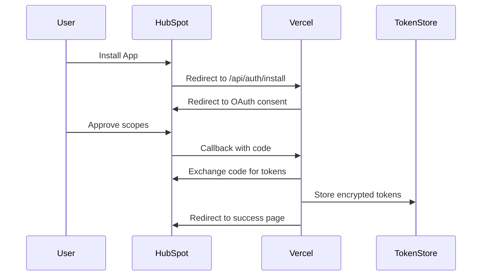
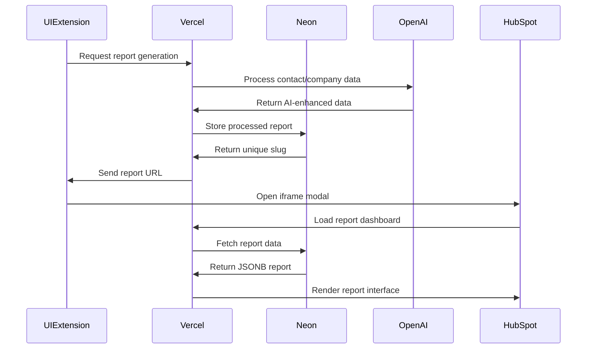

# Technical Solution Architecture

## HubSpot UI Extension with Sales Intelligence Backend

### Architecture Overview

```
┌─────────────────────┐     ┌─────────────────────┐     ┌─────────────────────┐
│   HubSpot CRM       │     │   Vercel Backend    │     │   Neon Database     │
│                     │     │   (Production)      │     │   (PostgreSQL 17)   │
│ ┌─────────────────┐ │     │ ┌─────────────────┐ │     │ ┌─────────────────┐ │
│ │ UI Extension    │ │────▶│ │ OAuth Handler   │ │────▶│ │ Reports Table   │ │
│ │ (React)         │ │     │ └─────────────────┘ │     │ │ JSONB + Indexes │ │
│ └─────────────────┘ │     │                     │     │ └─────────────────┘ │
│                     │     │ ┌─────────────────┐ │     │                     │
│ ┌─────────────────┐ │     │ │ HubSpot ID API  │ │────▶│ ┌─────────────────┐ │
│ │ Context Data    │ │     │ │ /by-hubspot-id  │ │     │ │ Indexed Queries │ │
│ │ (Contact/Comp)  │ │     │ └─────────────────┘ │     │ │ company_id      │ │
│ └─────────────────┘ │     │                     │     │ │ contact_id      │ │
│                     │     │ ┌─────────────────┐ │     │ │ slug            │ │
│ ┌─────────────────┐ │     │ │ Report Display  │ │────▶│ └─────────────────┘ │
│ │ hubspot.fetch() │ │────▶│ │ React + Vite    │ │     │                     │
│ └─────────────────┘ │     │ │ Tailwind CSS    │ │     │ ┌─────────────────┐ │
└─────────────────────┘     │ └─────────────────┘ │     │ │ JSONB Payload   │ │
                            └─────────────────────┘     │ │ Flexible Schema │ │
                                                        │ └─────────────────┘ │
                                                        └─────────────────────┘
```

### Component Architecture

#### 1. HubSpot UI Extension (Frontend)

```typescript
// Component Structure
├── src/app/extensions/
│   ├── ReportSelector.jsx       // Main UI component
│   ├── report-card.json         // Extension configuration
│   ├── hooks/
│   │   ├── useReports.js       // Report fetching logic
│   │   └── useHubSpotContext.js // Context handling
│   └── components/
│       ├── ReportDropdown.jsx   // Report selection
│       └── LoadingState.jsx     // Loading indicator
```

#### 2. Sales Intelligence Backend (Vercel)

```typescript
// API Structure
├── api/
│   ├── report/[slug].ts      // Individual report retrieval
│   ├── reports/
│   │   └── by-hubspot-id.ts  // Query by HubSpot contact/company ID
│   └── schemas/
│       └── [key].ts          // Schema registry endpoints
├── client/                   // React frontend (Vite build)
│   ├── src/
│   │   ├── components/       // Report display components
│   │   ├── pages/           // Report pages and API docs
│   │   └── lib/             // Database types and utilities
├── server/
│   ├── db.ts                // Neon PostgreSQL connection
│   └── services/
│       └── openai.ts        // AI processing service
└── vercel.json              // Deployment configuration
```

#### 3. Integration Flow

##### OAuth Authentication Flow



##### Sales Intelligence Report Flow



### Data Models

#### Database Schema (Neon PostgreSQL)

```sql
CREATE TABLE reports (
  id SERIAL PRIMARY KEY,
  slug VARCHAR(255) UNIQUE NOT NULL,
  schema_key VARCHAR(100) NOT NULL,
  hubspot_record_id VARCHAR(100),
  hubspot_company_id VARCHAR(100),
  hubspot_contact_id VARCHAR(100),
  original_payload JSONB,
  payload JSONB NOT NULL,
  processed_payload JSONB,
  created_at TIMESTAMP WITH TIME ZONE DEFAULT NOW(),
  updated_at TIMESTAMP WITH TIME ZONE DEFAULT NOW()
);

-- Optimized indexes for HubSpot queries
CREATE INDEX idx_reports_hubspot_company_id ON reports(hubspot_company_id)
  WHERE hubspot_company_id IS NOT NULL;
CREATE INDEX idx_reports_hubspot_contact_id ON reports(hubspot_contact_id)
  WHERE hubspot_contact_id IS NOT NULL;
CREATE UNIQUE INDEX reports_slug_unique ON reports(slug);
```

#### JSONB Report Structure

```typescript
interface ReportPayload {
  basic_information: {
    first_name: string;
    last_name: string;
    company_name: string;
    title: string;
    email: string;
    phone?: string;
    linkedin_url: string;
    company_summary: string;
    profile_pic_url: string;
    company_logo_url: string;
    use_case: string;
    key_technologies: string[];
  };
  company_context: object;
  b2b_persona_messaging: object;
  outreach_context: object;
  segmentation_strategy: object;
  outreach_executed: object;
  next_steps: object;
  team_expansion: object;
  outreach_messages_sent: object;
  sequence_start_date: string;
  sequence_start_timestamp: string;
  hubspot_contact_id?: string;
  hubspot_company_id?: string;
  tokensUsed: number;
  inputTokens: number;
  outputTokens: number;
  totalCostToAIProvider: string;
}
```

#### API Contracts

##### Available Reports Endpoint

```typescript
// GET /api/reports/available
Request: {
  headers: {
    authorization: 'Bearer {hubspot_access_token}'
  },
  query: {
    contactId?: string;
    companyId?: string;
  }
}

Response: {
  reports: Array<{
    id: string;
    name: string;
    description: string;
    hasData: boolean;
  }>;
}
```

##### Query Reports by HubSpot ID

```typescript
// GET /api/reports/by-hubspot-id
Request: {
  query: {
    contactId?: string;
    companyId?: string;
  }
}

Response: {
  success: boolean;
  data: Array<{
    id: number;
    slug: string;
    schema_key: string;
    hubspot_company_id: string;
    hubspot_contact_id: string;
    basic_info: object;
    created_at: string;
  }>;
}
```

##### Create Report Endpoint

```typescript
// POST /api/report
Request: {
  body: {
    schemaKey: "sales-intel-v1"; // Required
    hubspotContactId?: string;
    hubspotCompanyId?: string;
    reportData: any; // Flexible JSONB structure
  }
}

Response: {
  success: boolean;
  data: {
    id: number;
    url: string;
    slug: string;
    hubspot_company_id?: string;
    hubspot_contact_id?: string;
    created_at: string;
    processing_time_ms: number;
  }
}
```

### Security Architecture

#### Token Security

- Encryption at rest using AES-256
- Token rotation on refresh
- Secure key management via environment variables
- No tokens exposed to frontend

#### CORS Configuration

```typescript
const corsOptions = {
  origin: [
    'https://app.hubspot.com',
    'https://app-eu1.hubspot.com',
    process.env.VERCEL_URL,
  ],
  credentials: true,
  methods: ['GET', 'POST'],
  allowedHeaders: ['Content-Type', 'Authorization'],
};
```

#### Content Security Policy

```typescript
const cspHeaders = {
  'Content-Security-Policy':
    "frame-ancestors 'self' https://*.hubspot.com https://*.hubspotpreview-eu1.com;",
  'X-Frame-Options': 'ALLOWALL',
};
```

### Performance Optimization

#### Caching Strategy

1. **Token Cache**: 5-minute TTL for access tokens
2. **Report Availability**: 1-minute cache per user
3. **CDN Caching**: Static assets on Vercel Edge

#### Database Optimization

- Neon PostgreSQL serverless connection pooling
- Conditional indexes on hubspot_company_id and hubspot_contact_id
- JSONB storage with indexed columns for fast queries
- Optimized for HubSpot UI extension query patterns

### Error Handling

#### Error Types

```typescript
enum ErrorCode {
  UNAUTHORIZED = 'unauthorized',
  TOKEN_EXPIRED = 'token_expired',
  REPORT_NOT_FOUND = 'report_not_found',
  INSUFFICIENT_PERMISSIONS = 'insufficient_permissions',
  RATE_LIMITED = 'rate_limited',
}
```

#### Error Responses

```typescript
interface ErrorResponse {
  error: {
    code: ErrorCode;
    message: string;
    details?: any;
  };
  timestamp: string;
  requestId: string;
}
```

### Monitoring & Observability

#### Logging Strategy

- Structured JSON logging
- Request/response tracking
- Error aggregation
- Performance metrics

#### Key Metrics

- OAuth success rate
- API response times
- Report load times
- Error rates by type

### Deployment Architecture

#### Vercel Configuration

```json
{
  "version": 2,
  "buildCommand": "npm run build",
  "outputDirectory": "dist/public",
  "functions": {
    "api/**/*.ts": {
      "maxDuration": 30
    }
  },
  "routes": [
    {
      "src": "/api/(.*)",
      "dest": "/api/$1",
      "headers": {
        "Access-Control-Allow-Origin": "*",
        "Access-Control-Allow-Methods": "GET, POST, PUT, DELETE, OPTIONS",
        "Access-Control-Allow-Headers": "Content-Type, Authorization"
      }
    },
    {
      "src": "/(.*)",
      "dest": "/index.html"
    }
  ]
}
```

#### Environment Variables

- Production vs Development separation
- Secure storage in Vercel
- Environment-specific configurations

### Scalability Considerations

#### Horizontal Scaling

- Stateless API design
- Distributed token storage
- Load balanced Vercel functions

#### Rate Limiting

- Implement request queuing
- Respect HubSpot limits
- User-based throttling

### Disaster Recovery

#### Backup Strategy

- Token backup encryption
- Configuration versioning
- Automated recovery procedures

#### Failover Mechanisms

- Graceful degradation
- Retry logic with exponential backoff
- Circuit breaker pattern
