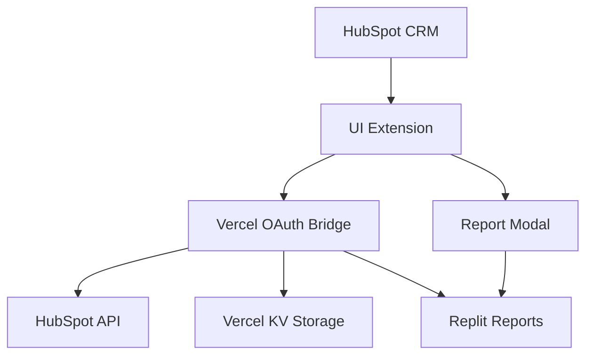

# HubSpot Replit Integration

A comprehensive HubSpot UI Extension that seamlessly integrates Replit reports into the HubSpot CRM interface using a secure OAuth bridge.

## 🚀 Features

- **Secure OAuth Integration**: Complete OAuth 2.0 flow with encrypted token storage
- **Dynamic Report Selection**: Automatically detects available reports for contacts/companies
- **Iframe Modal Display**: Reports load in secure iframe modals within HubSpot
- **Multi-tenant Support**: Handles multiple HubSpot accounts simultaneously
- **Error Handling**: Comprehensive error handling with user-friendly messages
- **Performance Optimized**: Caching, rate limiting, and optimized API calls

## 📁 Project Structure

```
├── packages/
│   ├── hubspot-extension/     # React UI Extension for HubSpot
│   ├── vercel-backend/        # OAuth bridge API (Next.js)
│   └── shared/               # Common types and utilities
├── Documentation/            # Project documentation
└── scripts/                 # Build and deployment scripts
```

## 🔧 Setup Instructions

### 1. Prerequisites

- Node.js 18+ and npm 9+
- HubSpot Developer Account with UI Extensions Early Access
- Vercel Account
- Replit Account with API access

### 2. Environment Configuration

#### Vercel Backend (.env.local)

```bash
# HubSpot OAuth
HUBSPOT_CLIENT_ID=your_hubspot_client_id
HUBSPOT_CLIENT_SECRET=your_hubspot_client_secret
HUBSPOT_REDIRECT_URI=https://your-domain.vercel.app/api/auth/callback

# Security
ENCRYPTION_KEY=your_32_character_encryption_key
JWT_SECRET=your_jwt_secret_for_signing_tokens

# External APIs
REPLIT_API_URL=https://your-reports.replit.app
REPLIT_API_KEY=your_replit_api_key

# Vercel KV Storage
KV_REST_API_URL=https://your-kv-instance.upstash.io
KV_REST_API_TOKEN=your_kv_token
```

### 3. Installation

```bash
# Install dependencies
npm install

# Install dependencies for all packages
npm install --workspaces

# Build shared package
cd packages/shared && npm run build
```

### 4. Development

```bash
# Start Vercel backend development server
cd packages/vercel-backend && npm run dev

# In another terminal, start HubSpot extension development
cd packages/hubspot-extension && hs project dev
```

### 5. Deployment

#### Deploy Vercel Backend

```bash
cd packages/vercel-backend
vercel --prod
```

#### Deploy HubSpot Extension

```bash
cd packages/hubspot-extension
hs project upload
```

## 🔐 Security Features

- **Token Encryption**: All OAuth tokens encrypted with AES-256
- **Secure Storage**: Tokens stored in Vercel KV with expiration
- **CORS Protection**: Proper CORS configuration for HubSpot domains
- **Request Signing**: JWT signing for additional URL security
- **Rate Limiting**: Built-in rate limiting on all endpoints

## 📊 Architecture



## 🔄 OAuth Flow

1. User clicks "Install" in HubSpot App Marketplace
2. Redirect to `/api/auth/install` with portal ID
3. Redirect to HubSpot OAuth consent screen
4. User approves, HubSpot redirects to `/api/auth/callback`
5. Exchange code for tokens, encrypt and store in Vercel KV
6. User can now view reports in UI Extension

## 🛠️ API Endpoints

### Authentication

- `GET /api/auth/install` - Initiate OAuth flow
- `GET /api/auth/callback` - Handle OAuth callback
- `POST /api/auth/refresh` - Refresh expired tokens
- `GET /api/auth/status` - Check token status

### Reports

- `GET /api/reports/available` - Get available reports
- `POST /api/reports/generate-url` - Generate signed report URL

### Health

- `GET /api/health` - Health check endpoint

## 🧪 Testing

```bash
# Run all tests
npm test

# Run tests for specific package
npm test --workspace=packages/vercel-backend

# Run with coverage
npm run test:coverage
```

## 📝 Development Guidelines

See [CLAUDE.md](./CLAUDE.md) for comprehensive development guidelines including:

- OAuth security requirements
- API development standards
- Error handling practices
- Testing requirements
- Deployment processes

## 🔍 Monitoring

- **Error Tracking**: Structured logging with request IDs
- **Performance Metrics**: API response time monitoring
- **Authentication Metrics**: OAuth success/failure rates
- **Usage Analytics**: Report view tracking

## 🚨 Troubleshooting

### Common Issues

1. **Token Expired**: Check `/api/auth/status` and refresh if needed
2. **CORS Errors**: Verify Vercel domain in HubSpot app settings
3. **Report Not Loading**: Check Replit API connectivity
4. **Missing Reports**: Verify HubSpot object IDs and permissions

### Debug Commands

```bash
# Check token status
curl -X GET "https://your-domain.vercel.app/api/auth/status?portalId=123"

# Test report availability
curl -X GET "https://your-domain.vercel.app/api/reports/available?portalId=123&contactId=456"

# Check health
curl -X GET "https://your-domain.vercel.app/api/health"
```

## 📄 License

MIT License - see [LICENSE](./LICENSE) for details.

## 🤝 Contributing

1. Fork the repository
2. Create a feature branch
3. Make your changes
4. Run tests and linting
5. Submit a pull request

## 📞 Support

For support, please contact [support@your-company.com](mailto:support@your-company.com) or create an issue in this repository.
